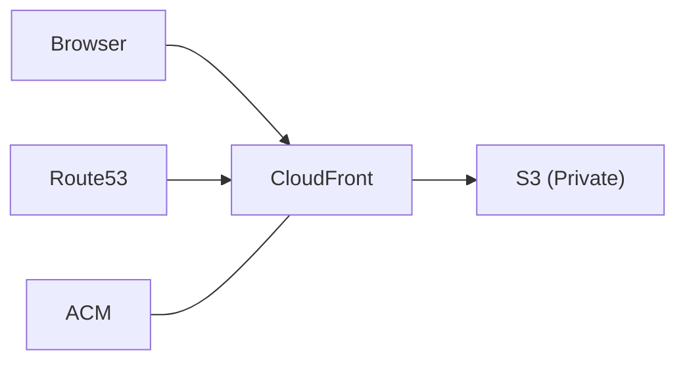

# Simple Clock Website

A real-time clock web application deployed on AWS using CDK.

## Project Context

- **Frontend**: TypeScript clock display (HTML/CSS/TypeScript)
- **Infrastructure**: AWS CDK deploying to S3, CloudFront, Route53, ACM
- **Purpose**: Portfolio project demonstrating web development and AWS skills

## Current State



The site currently displays a digital clock that updates every second using JavaScript.

## Improvement Roadmap

### Frontend
1. **Time Zone Support**: Add dropdown to select different time zones
2. **Analog Clock**: Create SVG-based analog display with toggle option
3. **Theme Toggle**: Implement dark/light theme with system preference detection
4. **Accessibility**: Add ARIA attributes and keyboard navigation
5. **Date Display**: Show current date below clock

### Infrastructure
1. **CI/CD Pipeline**: GitHub Actions for automated testing and deployment
2. **Monitoring**: CloudWatch metrics and basic alerts
3. **Performance**: Optimize caching and asset delivery

### Developer Experience
1. **Tests**: Add frontend unit tests and infrastructure tests
2. **Documentation**: Improve JSDoc comments and setup instructions

## Quick Start

```bash
npm install     # Install dependencies
npm run dev     # Local development
npm run deploy  # Deploy to AWS
```

### Deployment Requirements
- Node.js
- AWS CLI configured
- AWS CDK CLI installed
