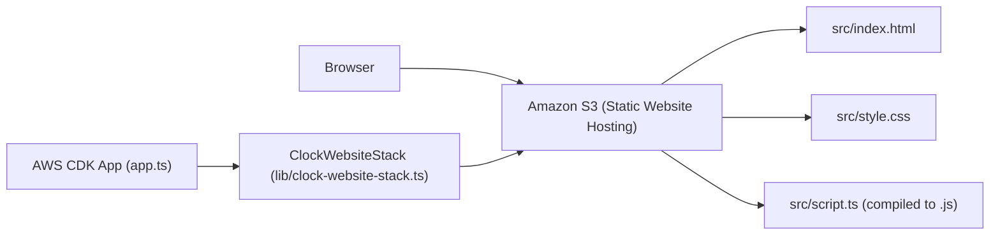

# Simple Clock Website Project Context

This project's primary goal is to deploy a simple static website that displays a real-time clock. The infrastructure is managed using AWS Cloud Development Kit (CDK), deploying the website content to an Amazon S3 bucket configured for static hosting.

## Key Components and Architecture

The project consists of two main parts:

1.  **Frontend:** The static website content (HTML, CSS, JavaScript) located in the `src/` directory. This code runs in the user's browser to display and update the clock.
2.  **Infrastructure:** The AWS resources required to host the website, defined using AWS CDK in TypeScript. Currently, this is primarily an S3 bucket configured for static website hosting.


*(Note: The `script.ts` file is compiled to JavaScript before deployment)*

## Important Files and Directories

*   `app.ts`: The entry point for the AWS CDK application. It loads the stack definition.
*   `lib/`: Contains the infrastructure stack definitions.
    *   `lib/clock-website-stack.ts`: **Crucial file** defining the AWS resources (S3 bucket) and their configuration for the website.
*   `src/`: Contains all the frontend source code.
    *   `src/index.html`: The main HTML structure of the website.
    *   `src/script.ts`: Contains the TypeScript/JavaScript logic for the clock functionality.
    *   `src/style.css`: Contains the CSS for styling the clock and website layout.
*   `package.json`: Manages project dependencies (Node.js packages, CDK libraries) and defines build/deployment scripts (`npm run build`, `npm run deploy`, etc.).
*   `tsconfig.json`: TypeScript compiler configuration.
*   `.gitignore`: Specifies intentionally untracked files that Git should ignore (e.g., `node_modules`, `cdk.out`).

## Core Functionality

The website displays a simple clock. The logic for fetching and displaying the current time is intended to be implemented within `src/script.ts`. The styling is handled by `src/style.css`.

## Prerequisites

*   Node.js (LTS recommended)
*   npm
*   AWS CLI (configured)
*   AWS CDK CLI (`npm install -g aws-cdk`)

## Setup

1.  Clone the repository.
2.  Run `npm install` to install dependencies.
3.  Run `npm run build` to compile TypeScript.

## Deployment

To deploy the clock website to your AWS account using CDK, follow these steps:

1.  **Bootstrap your AWS environment:** If you haven't already, you need to bootstrap your AWS account and region for CDK deployment. This is a one-time setup step per environment.
    ```bash
    cdk bootstrap
    ```
    You will be prompted to approve the creation of necessary resources (like an S3 bucket and IAM roles) in your AWS account.

2.  **Build the website:** Ensure your static website content is built and ready for deployment.
    ```bash
    npm run build
    ```
    This command uses Vite to build the website and places the output in the `./dist` directory.

3.  **Deploy the CDK stack:** Deploy the infrastructure and website content to AWS.
    ```bash
    npm run deploy
    ```
    This command will compile the CDK code and deploy the `ClockWebsiteStack`, creating the S3 bucket and uploading the contents of the `./dist` directory. You will be prompted to review and approve the changes before deployment.

**⚠️ WARNING: Data Loss Risk ⚠️**

The S3 bucket is configured with `removalPolicy: cdk.RemovalPolicy.DESTROY` and `autoDeleteObjects: true`. Deleting the CDK stack (`cdk destroy`) will permanently delete the S3 bucket and all its contents.

## Accessing the Website

The S3 static website endpoint URL will be shown in the output of the `npm run deploy` command.

## Known Issues / TODOs

*   Implement the actual clock logic in `src/script.ts`.
*   Add styling in `src/style.css`.
*   Consider more secure S3 hosting (e.g., OAC/OAI with CloudFront) instead of public access.
*   Add features like time zone selection or alarms.
*   Implement unit/integration tests.
